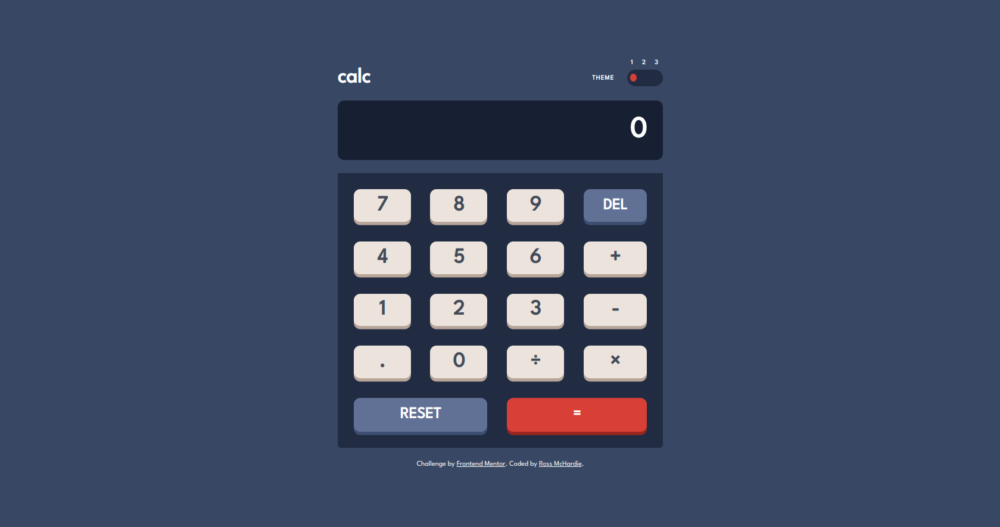

# Frontend Mentor - Calculator app solution

This is a solution to the [Calculator app challenge on Frontend Mentor](https://www.frontendmentor.io/challenges/calculator-app-9lteq5N29).

## Table of contents

- [Overview](#overview)
  - [The challenge](#the-challenge)
  - [Screenshot](#screenshot)
  - [Links](#links)
- [My process](#my-process)
  - [Built with](#built-with)
  - [What I learned](#what-i-learned)
  - [Continued development](#continued-development)
  - [Useful resources](#useful-resources)
- [Author](#author)
- [Acknowledgments](#acknowledgments)

## Overview

### The challenge

Users should be able to:

- See the size of the elements adjust based on their device's screen size
- Perform mathmatical operations like addition, subtraction, multiplication, and division
- Adjust the color theme based on their preference
- **Bonus**: Have their initial theme preference checked using `prefers-color-scheme` and have any additional changes saved in the browser
- **Bonus**: Use their keyboard to operate the calculator

### Screenshot

### Links

- Solution URL: (https://github.com/rmchardie/calculator-app)
- Live Site URL: (https://rmchardie.github.io/calculator-app)

## My process

Step 1: I structured the HTML, using the included designs to give meaningful class names to the different divs and components, giving each button an id and a value so I could manipulate them using CSS and Javascript later on, leaving comments to remind me.

Step 2: Next up was the CSS and styling the components as close to the included designs as possible, I did this by using custom properties to make coding the theme switcher easier. I used a media query to make the app responsive for smart phones.

Step 3: I tried to make the app code as D.R.Y. as possible using loops, functions and switch statements, commenting as I progressed so I knew what each function was intended to do.

### Built with

- Semantic HTML5 markup
- CSS custom properties
- Flexbox
- CSS Grid
- Mobile-first workflow
- Vanilla JS

### What I learned

For what seemed like such a simple concept, I learned a lot about CSS and Javascript while completing this challenge (along with a few frustrations).

- CSS
  I learned all about Custom properties and how they can improve your workflow, for instance, if you decide half way through building the app that you want to change the main colour that you have used everywhere, you don't have to change ever instance of it, you can just change the custom property and it will update everywhere else.

  I also learned (and understand a lot more) about Flexbox and Grid and how they make responsive design so much easier.

- Vanilla JS
  I learned a lot about keyboard input and how to manipulate css properties and the DOM through event listeners and dry code using switch statements and foreach loops.

  The most difficult part for me was getting the calculator display to include thousand commas during input and after calculation because no matter what I tried to do, something else ended up breaking.

  I finally got it functioning and realised I was calling the function in the wrong place with the wrong parameters and felt so stupid afterwards. Impostor Sydrome was setting in hard!!

### Continued development

To continue my development, I'd like to see if I could create it again from scratch without any help or research using a mobile-first approach and also maybe recreate this app using a framework - React for example - to see how the code differs.

### Useful resources

- [Zero to Mastery](https://www.zerotomastery.io) - I completed the calculator challenge with very little "Googling", a module from their Javascript apps course helped me rewrite the code so that it worked in conjuction with the thousand comma function that was giving me endless headaches.

## Author

- GitHub - [Rossco](https://www.github.com/rmchardie)
- Frontend Mentor - [@rmchardie](https://www.frontendmentor.io/profile/rmchardie)
- Dev.io - [@rmchardie](https://www.dev.to/rmchardie)

## Acknowledgments

- Andrei Neagoie, Zero to Mastery, love to learn new things from his courses.

- Jacinto Wong, Javascript Web Projects, Zero to Mastery, he knows his stuff and helped me out with combining the calculation with the thousands comma separator.
